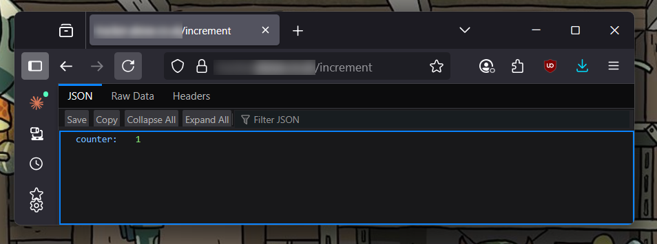

# Playground - Cloudflare Workers

Deploys a Cloudflare D1 Database and a worker with a few simple endpoints.

## Why this exists

This is a proof of concept which:

- uses `bun` instead of `npm` (it's much faster)
- use a free tier Cloudflare `D1` database
- use Terraform to deploy the database and worker on Cloudflare
- use a worker-compatible lightweight typescript-first API framework [Hono](https://hono.dev/)

## Build and Deploy

Create `infrastructure/terraform.tfvars` with:

```
cloudflare_api_token = ""
zone_id              = ""
account_id           = ""
domain_name          = "tracker.example.co.uk"
```

From the rood directory using `bun`:

```
bun run deploy
```

## Notes

The important files are the [infrastructure\main.tf](infrastructure\main.tf) and the [api\src\index.ts](api\src\index.ts).

We create a new subdomain and bind a worker with a pattern to match and intercept all calls. Calls are routed to the worker.

We then build an application locally and bundle it into a .js file and deploy it each time it changes to the worker.

We then deploy a D1 database and use SQL to increment and decrement the values over an API. The API is written in typescript and Hono.

## Endpoints

- `/migrate` - Runs the migration scripts
- `/increment` - Increments the counter by 1
- `/decrement` - Decrements the counter by 1
- `/count` - Returns the current count



